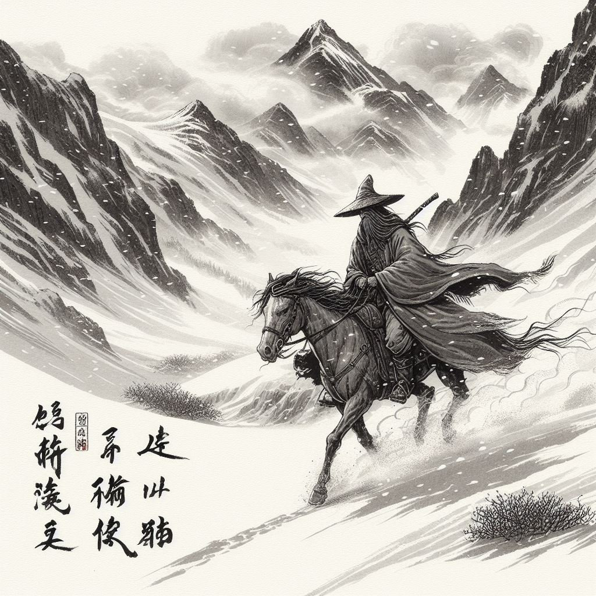
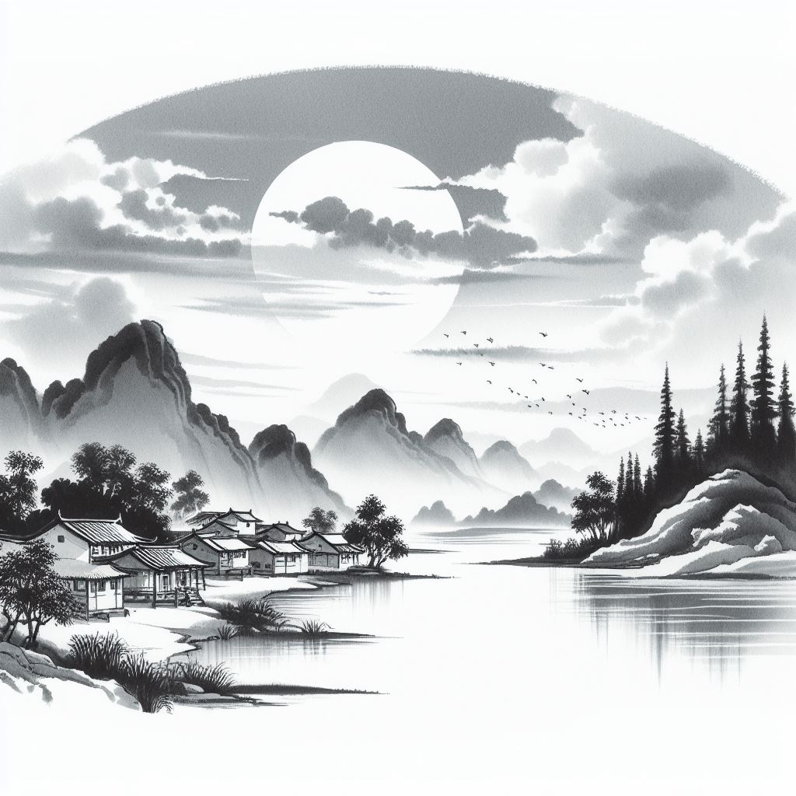
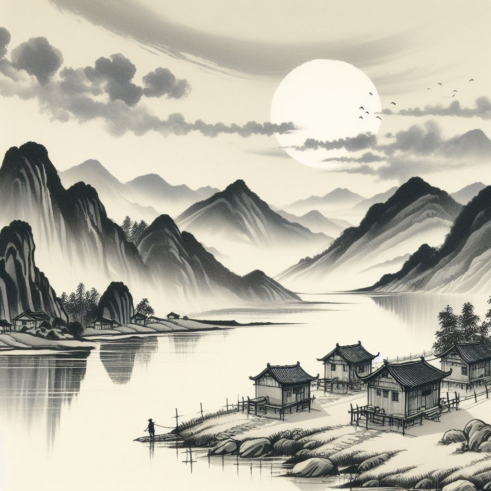
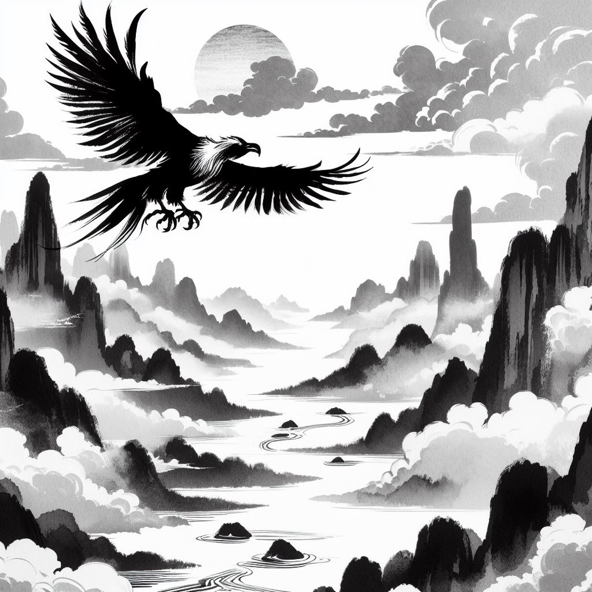

# Bing AI Poetry

> 关山别荡子，风月守空闺。 —— 薛道衡《昔昔盐》

|      |      |      |
| :----: | :----: | :----: |
|[0.jpg](https://tse1.mm.bing.net/th/id/OIG.0lT30AZgF0Y9TGnssoUu)|[1.jpg](https://tse2.mm.bing.net/th/id/OIG.AYKgb1ftqrAfxCfwGjCs)|[2.jpg](https://tse1.mm.bing.net/th/id/OIG.GcNrrihRgfhlHOwiRtR.)|

> 城里夕阳城外雪，相将十里异阴晴。 —— 王守仁《次韵陆佥宪元日春晴》

|      |      |      |      |
| :----: | :----: | :----: | :----: |
|[0.jpg](https://tse3.mm.bing.net/th/id/OIG.3Rutx5swGhJl2OdaOfc1)|[1.jpg](https://tse3.mm.bing.net/th/id/OIG.EKOShqtdRmSrNB9.jNwx)|[2.jpg](https://tse4.mm.bing.net/th/id/OIG.uqILLR6wkNLsvukyP2pW)|[3.jpg](https://tse2.mm.bing.net/th/id/OIG.QlCk0de576sDlnx9ZVPb)|

> 父兮生我，母兮鞠我。 —— 佚名《蓼莪》

|      |      |      |      |
| :----: | :----: | :----: | :----: |
|[0.jpg](https://tse3.mm.bing.net/th/id/OIG.jKBa3t0LTaj1EJiKV1n2)|[1.jpg](https://tse4.mm.bing.net/th/id/OIG.vOk2IEvsn9lIGI3dMJ1d)|[2.jpg](https://tse1.mm.bing.net/th/id/OIG.OZMv9rKn4G2JoqRe34jj)|[3.jpg](https://tse3.mm.bing.net/th/id/OIG.m.IcBuZAquD0HwJtZCJn)|

> 岁岁金河复玉关，朝朝马策与刀环。 —— 柳中庸《征人怨 / 征怨》

|      |      |      |      |
| :----: | :----: | :----: | :----: |
|[0.jpg](https://tse1.mm.bing.net/th/id/OIG.v9AbdG1R4GvmMGbkOvVQ)|[1.jpg](https://tse4.mm.bing.net/th/id/OIG.OVsCFutV.oPiTJuU9EZx)|[2.jpg](https://tse2.mm.bing.net/th/id/OIG.UtPqTkzAGCeWhLVjAplS)|[3.jpg](https://tse1.mm.bing.net/th/id/OIG.TuORFP5oxLmZEJS7ukJI)|
> 隋堤三月水溶溶。背归鸿，去吴中。 —— 苏轼《江神子·恨别》

|      |      |      |      |
| :----: | :----: | :----: | :----: |
|[0.jpg](https://tse1.mm.bing.net/th/id/OIG.uI_vGGsrx21Bx6OnsLzx)|[1.jpg](https://tse2.mm.bing.net/th/id/OIG.Mu4F8wbwK1E1Cj4Z7tFr)|[2.jpg](https://tse4.mm.bing.net/th/id/OIG.AQ1lm4D6FYZq5cinV_g9)|[3.jpg](https://tse1.mm.bing.net/th/id/OIG.UEkOHKlHesAIU8TmQrHw)|

> 灵山多秀色，空水共氤氲。 —— 张九龄《湖口望庐山瀑布泉 / 湖口望庐山瀑布水》

|      |      |      |      |
| :----: | :----: | :----: | :----: |
|[0.jpg](https://tse3.mm.bing.net/th/id/OIG.6NbwmhLVLWllYch.r215)|[1.jpg](https://tse4.mm.bing.net/th/id/OIG.iDhWyIMlIIq1sLa3uzL7)|[2.jpg](https://tse1.mm.bing.net/th/id/OIG.MoAMb2atK_FrGRBAjDzz)|[3.jpg](https://tse3.mm.bing.net/th/id/OIG.wsQ0TbXBX6AMqdAc2I6P)|

> 况是青春日将暮，桃花乱落如红雨。 —— 李贺《将进酒》

|      |      |      |      |
| :----: | :----: | :----: | :----: |
|[0.jpg](https://tse1.mm.bing.net/th/id/OIG.4uetEcKJyD5BKMvxhNvd)|[1.jpg](https://tse3.mm.bing.net/th/id/OIG.EmgCXAjzIUzl9LJiIRcV)|[2.jpg](https://tse2.mm.bing.net/th/id/OIG.EIZE.Cor_7kPCBfnqIdO)|[3.jpg](https://tse3.mm.bing.net/th/id/OIG.EEVffs_Cvp4iQEP3e7yg)|

> 鹊辞穿线月，花入曝衣楼。 —— 李贺《七夕》

|      |      |      |      |
| :----: | :----: | :----: | :----: |
|[0.jpg](https://tse1.mm.bing.net/th/id/OIG.812BWZ1Krv9cib5bMZN8)|[1.jpg](https://tse1.mm.bing.net/th/id/OIG.qJ05maChmKYpxJghB0es)|[2.jpg](https://tse4.mm.bing.net/th/id/OIG.UrWv3gx7eJaN6MvPmNnI)|[3.jpg](https://tse3.mm.bing.net/th/id/OIG.l53P9HgG1KUIUjLpaEYh)|

> 君怀良不开，贱妾当何依。 —— 曹植《明月上高楼》

|      |      |      |      |
| :----: | :----: | :----: | :----: |
|[0.jpg](https://tse1.mm.bing.net/th/id/OIG.qxGQZPR1XBqDR2JOPy0r)|[1.jpg](https://tse4.mm.bing.net/th/id/OIG.IAUYg7iVVuPlXKREUdYd)|[2.jpg](https://tse2.mm.bing.net/th/id/OIG.13gZoFJ8_dFJTBxXzDA4)|[3.jpg](https://tse2.mm.bing.net/th/id/OIG.vVxuUqcao1CUbqXzY.LG)|

> 何处望神州？满眼风光北固楼。 —— 辛弃疾《南乡子·登京口北固亭有怀》

|      |      |      |      |
| :----: | :----: | :----: | :----: |
|[0.jpg](https://tse1.mm.bing.net/th/id/OIG.u4WW8YtZC_hHmpFtGLPi)|[1.jpg](https://tse3.mm.bing.net/th/id/OIG.b0UdLkL0sZiGyNFdjcek)|[2.jpg](https://tse4.mm.bing.net/th/id/OIG.0.oc6cWL0gTLgXoMJ6nN)|[3.jpg](https://tse3.mm.bing.net/th/id/OIG.wfdDlu5sjQ5AEL1NgM6L)|

> 一自胡尘入汉关，十年伊洛路漫漫。 —— 陈与义《咏牡丹》

|      |      |      |      |
| :----: | :----: | :----: | :----: |
|[0.jpg](https://tse3.mm.bing.net/th/id/OIG.Z8dZlDPj5QxW08qaBiJK)|[1.jpg](https://tse4.mm.bing.net/th/id/OIG.CEtN4hpSascouGuF9tlI)|[2.jpg](https://tse4.mm.bing.net/th/id/OIG.g2cy0fTNdETnQugkXn0l)|[3.jpg](https://tse2.mm.bing.net/th/id/OIG.qqOvGD3kVJBafFVDzjpW)|

> 白日依山尽，黄河入海流。 —— 王之涣《登鹳雀楼》

|      |      |      |      |
| :----: | :----: | :----: | :----: |
|[0.jpg](https://tse4.mm.bing.net/th/id/OIG.sK_3Ygt9pXfc6CjCwA5a)|[1.jpg](https://tse4.mm.bing.net/th/id/OIG.hQhaFPz9crXkru.q59Cd)|[2.jpg](https://tse3.mm.bing.net/th/id/OIG.YlTW5CMZfTtcAUBovV8t)|[3.jpg](https://tse3.mm.bing.net/th/id/OIG.6B6GQUjN4FN2lknRdOI9)|

> 芳洲拾翠暮忘归，秀野踏青来不定。 —— 张先《木兰花·乙卯吴兴寒食》

|      |      |      |      |
| :----: | :----: | :----: | :----: |
|[0.jpg](https://tse2.mm.bing.net/th/id/OIG.nxo6CXB_83sXU0IxwkWf)|[1.jpg](https://tse4.mm.bing.net/th/id/OIG.W.Vv86dQ.Hn5kO5Fm0yf)|[2.jpg](https://tse2.mm.bing.net/th/id/OIG.eKDfZdE6HQP9Wj8YIqHe)|[3.jpg](https://tse3.mm.bing.net/th/id/OIG.8JO5TJciJTc9j.rw0gNq)|

> 锄禾日当午，汗滴禾下土。 —— 李绅《古风二首 / 悯农二首》

|      |      |      |      |
| :----: | :----: | :----: | :----: |
|[0.jpg](https://tse2.mm.bing.net/th/id/OIG.5OHJeYhBaFjXQBz7NAMI)|[1.jpg](https://tse3.mm.bing.net/th/id/OIG.eaSicLawzfmn2JnGdDMw)|[2.jpg](https://tse4.mm.bing.net/th/id/OIG.jaxV4XxAWw06zjDHBVws)|[3.jpg](https://tse2.mm.bing.net/th/id/OIG.c8gfZCXgQeMsitWMC_aF)|

> 白兔捣药秋复春，嫦娥孤栖与谁邻？ —— 李白《把酒问月·故人贾淳令予问之》

|      |      |      |      |
| :----: | :----: | :----: | :----: |
|[0.jpg](https://tse2.mm.bing.net/th/id/OIG.R9aeYatcpfhn.QIxRPPn)|[1.jpg](https://tse2.mm.bing.net/th/id/OIG.fVd_XN6Heltq3eUmAQLK)|[2.jpg](https://tse2.mm.bing.net/th/id/OIG.M5KcEDMAjlStOW_wR5jS)|[3.jpg](https://tse1.mm.bing.net/th/id/OIG.N4mwCn38fcDHGSQlMWZ3)|

> 最爱湖东行不足，绿杨阴里白沙堤。 —— 白居易《钱塘湖春行》

|      |      |      |      |
| :----: | :----: | :----: | :----: |
|[0.jpg](https://tse1.mm.bing.net/th/id/OIG.yC9ulGvgYKVbhXRmbz11)|[1.jpg](https://tse3.mm.bing.net/th/id/OIG.fJ0VruOC7cqN.ECLJmya)|[2.jpg](https://tse1.mm.bing.net/th/id/OIG.ERk9bRYbJ..upDLa_.ic)|[3.jpg](https://tse2.mm.bing.net/th/id/OIG.SOWvz9T8hX7ceJGqI2n6)|

> 城里夕阳城外雪，相将十里异阴晴。 —— 王守仁《次韵陆佥宪元日春晴》

|      |      |      |      |
| :----: | :----: | :----: | :----: |
|[0.jpg](https://tse4.mm.bing.net/th/id/OIG.CgHKnBNHwNb4QsvhNRDB)|[1.jpg](https://tse2.mm.bing.net/th/id/OIG.hYevm6wIHcpBBzyfICm4)|[2.jpg](https://tse4.mm.bing.net/th/id/OIG.RYT9.CWS0u4of91i.Z.8)|[3.jpg](https://tse4.mm.bing.net/th/id/OIG.Urd5yeIYPumKpwg9CJmF)|

> 酒贱常愁客少，月明多被云妨。 —— 苏轼《西江月·世事一场大梦》

|      |      |      |      |
| :----: | :----: | :----: | :----: |
|[0.jpg](https://tse2.mm.bing.net/th/id/OIG.5QzlWAbaFwALv6achyfp)|[1.jpg](https://tse3.mm.bing.net/th/id/OIG.CbFPcMIdiNxpLFws5tSB)|[2.jpg](https://tse2.mm.bing.net/th/id/OIG.1QY1Hcb4JDVpZbnQav9n)|[3.jpg](https://tse1.mm.bing.net/th/id/OIG.uFu5IgDIAdlDHiMBSby0)|

> 一轮秋影转金波。飞镜又重磨。 —— 辛弃疾《太常引·建康中秋夜为吕叔潜赋》

|      |      |      |      |
| :----: | :----: | :----: | :----: |
|[0.jpg](https://tse2.mm.bing.net/th/id/OIG.2yUfSxam45_H8OH.PrQu)|[1.jpg](https://tse2.mm.bing.net/th/id/OIG.Lw2sazWavqpUkQPixGJg)|[2.jpg](https://tse1.mm.bing.net/th/id/OIG.Fkg8DszVrk6CeIGvIyLi)|[3.jpg](https://tse3.mm.bing.net/th/id/OIG.ADoY2tz3DbQ9kvOPO1CH)|

> 大鹏一日同风起，扶摇直上九万里。 —— 李白《上李邕》

|      |      |      |      |
| :----: | :----: | :----: | :----: |
|[0.jpg](https://tse2.mm.bing.net/th/id/OIG.rKQjmQOwTvcw0dY1.KMj)|[1.jpg](https://tse3.mm.bing.net/th/id/OIG.bhBpAVXEvIOe0KuX83yl)|[2.jpg](https://tse4.mm.bing.net/th/id/OIG.J2_P6rEy221U6HVMQffQ)|[3.jpg](https://tse2.mm.bing.net/th/id/OIG.EQR6OSDdVBTif4Cni8Pq)|

> 庐山秀出南斗傍，屏风九叠云锦张。 —— 李白《庐山谣寄卢侍御虚舟》

|      |      |      |      |
| :----: | :----: | :----: | :----: |
|[0.jpg](https://tse3.mm.bing.net/th/id/OIG.UVfoGAB.7q6EwKcNEir1)|[1.jpg](https://tse1.mm.bing.net/th/id/OIG.HfgtVxH9w.GbuWgp47Lo)|[2.jpg](https://tse4.mm.bing.net/th/id/OIG.h6292Nyc6rYCJkunGlCG)|[3.jpg](https://tse2.mm.bing.net/th/id/OIG.dusWyRLh3Mr53j1CLqKl)|

> 飞絮飞花何处是，层冰积雪摧残，疏疏一树五更寒。 —— 纳兰性德《临江仙·寒柳》

|      |      |      |      |
| :----: | :----: | :----: | :----: |
|[0.jpg](https://tse1.mm.bing.net/th/id/OIG.GcmL0XCumEupi8ZT0R.P)|[1.jpg](https://tse1.mm.bing.net/th/id/OIG.wIJfpttbfnrJbSCTf_qA)|[2.jpg](https://tse2.mm.bing.net/th/id/OIG.JVPT0DcnEGUP4N4dn4_U)|[3.jpg](https://tse1.mm.bing.net/th/id/OIG.hCEsCQPaP1qItlYpUcLC)|
